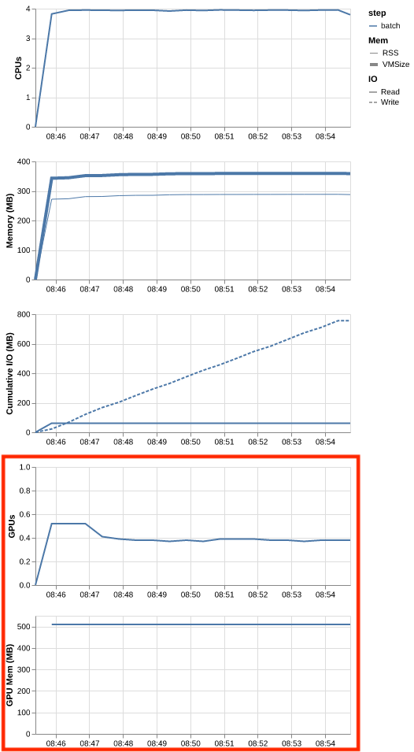

# 6. The tools for measuring a GPU job

!!! clipboard-list "Lesson Objectives"

    - Set up a short test job that jumps the queue
    - Turn on Slurm's profiling so there is something to look at afterwards
    - Read a job's efficiency with `seff`
    - Watch a running job's GPU with `nvtop`

!!! clipboard-question "Questions"

    - How do I run a test job without waiting all day for it?
    - Which command tells me what the GPU actually did?

[Chapter 5](05-measuring-your-jobs.md) said the whole method is *run something
short, then look at what it did*. This chapter is the four tools that make that
possible.

## A submit script for testing

A test job is not a normal job. You want it to start **now**, run **briefly**,
and record **everything** — none of which you want for production work.

```bash
#!/bin/bash -e
#SBATCH --job-name      gpu-test
#SBATCH --account       nesi99991
#SBATCH --time          00:15:00    (1)
#SBATCH --qos           debug       (2)
#SBATCH --gpus-per-node l4:1
#SBATCH --cpus-per-task 4
#SBATCH --mem           32GB
#SBATCH --profile       task        (3)
#SBATCH --acctg-freq    1           (4)
#SBATCH --output        gpu-test-%j.out

# your program here
```

1. **Fifteen minutes.** This is the maximum amount of time you can request on Mahuika with an alleviated priority on the debug queue. 
2. **Debug priority.** This increases the priority of your job so that you can quickly perform tests on your test jobs. 
3. **Profile this job**, so Slurm records what it did over time.
4. **Sample once a second**, rather than the much coarser default.

The lines described below exist only for testing. **Take them out of your production
scripts** 

### `--qos debug` — jumping the queue

This flag will increase the priority of your job so it get on the GPU faster. To activate it, 
include the following lines in your submit script

```bash
#SBATCH --qos debug
#SBATCH --time 00:15:00
```

### `--profile task` and `--acctg-freq 1` — recording what happened

`--profile task` tells slurm to take measurements of the CPU, GPU, and RAM resources that you
use for this job over time. 

* `--acctg-freq 1` tells slurm to take measurements every second the job runs. 

Include the following lines in your slurm submit scrupt. 

```bash
#SBATCH --profile task
#SBATCH --acctg-freq 1
```

## Running your job

Once you have set up your slurm script for a GPU type, number of CPUs, and a healthy amount of memory (RAM), 
submit it to slurm and allow it to queue and eventually run on Mahuika. 

### Live monitoring your job's GPU(s)

To dynamically inspect your running job's GPU usage:

1. Obtain the job id for your job of interest by typing `squeue --me` into the terminal.

    ```bash
    user.name@login03:$ squeue --me
    JOBID         USER     ACCOUNT   NAME        CPUS MIN_MEM PARTITI START_TIME     TIME_LEFT STATE    NODELIST(REASON)    
    1234567       user.nam nesi99999 Example_GPU_   8     24G genoa   Apr 30 17:36    23:58:08 RUNNING  g09               
    ```

2. Jump onto the node your job is running by typing `svisit <JobId>`, where you replace `<JobId>` with your Job of interest.

    ```bash
    user.name@login03:$ svisit 1234567
    user.name@g09:$ 
    ```

3. Type into the terminal `nvtop`. This will open an interface that will enable you to inspect your job's GPU resource usage.

    {: .center}

## Reading a finished job

### Using `seff` to summarise the full 15 minute job

Once the job has finished, use `seff` to provide a summary of the job

```bash
seff <JobID>
```

An example of the details provided by `seff` are shown below:

```
Cluster: hpc
Job ID: 1234567
State: TIMEOUT
Cores: 4
Tasks: 1
Nodes: 1
Job Wall-time:   100.4%  00:15:04 of 00:15:00 time limit
CPU Utilisation:  98.5%  00:59:20 of 01:00:16 core-walltime
Mem Utilisation:   1.2%  284.46 MB of 24.00 GB
GPU Utilisation:  43  %
GPU Memory:        2.2%  510.00 MB of 23 GB
```

Reading it against the decisions from stage 1:

| Line | What it is telling you | Which request it judges |
|---|---|---|
| **Job Wall-time** | How much of your time limit you used | `--time` |
| **CPU Utilisation** | How busy the cores you asked for were | [`--cpus-per-task`](03-how-many-cpus.md) |
| **Mem Utilisation** | Peak CPU memory against what you asked for | [`--mem`](04-how-much-memory.md) |
| **GPU Utilisation** | How much of the job the GPU was working | [`--cpus-per-task`](03-how-many-cpus.md), and your code |
| **GPU Memory** | Peak GPU memory against what the card has | [`--gpus-per-node`](02-which-gpu.md) |

### Using `profile_plot` to understand how the program performed over time

Sometimes `seff` doesn't tell you the full story about the resources being used, particularly the CPU and GPU
utilisation (as this is given as an average). Sometimes, it is better to see how your program perfromed over
the 15 minutes test job to properly understand how the CPU and GPU are being utilised. This is possible by using
the `--profile task` flag in slurm. 

Once the job has finished, type into the terminal:

```bash
profile_plot <JobID>
```

Where `<JobID>` is the job ID for the job of interest. This creates a file
called `<JobID>_profile.png`, which will look something like this:

{: .center}

Shown in the table below are details about the plots that are given by `profile_plot`:

| Panel | What it shows |
|---|---|
| **CPUs** | How many cores were actually in use |
| **Memory (MB)** | `RSS` — real memory held — and `VMSize`, the address space reserved |
| **Cumulative I/O (MB)** | Bytes read (solid) and written (dashed), adding up over the run |
| **GPUs** | GPU utilisation, as a fraction of one card |
| **GPU Mem (MB)** | How much GPU memory the job was holding |

!!! graduation-cap "Keypoints"

    - A test job wants **`--time 00:15:00` and `--qos debug`** so it starts
      straight away. Take the debug QoS out again afterwards.
    - **`--profile task` with `--acctg-freq 1`** records what the job did second
      by second. Testing only — never in a production script.
    - **`seff <JobID>`** after the job gives one number per resource, and each
      one judges a request you made in stage 1.
    - **`profile_plot <JobID>`** turns that into a graph over time. The average
      and the shape are different information.
    - **`squeue --me` → `svisit <JobID>` → `nvtop`** to watch a job live.
