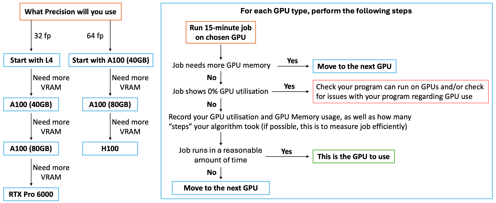

# 7. Putting it all together

!!! clipboard-list "Lesson Objectives"

    - Watch a running job and judge from the live display whether the GPU is busy
    - Use `seff` across a set of finished jobs to find the smallest card your
      work fits in
    - Use `seff` and `profile_plot` to settle the core count and the memory
      request
    - Write the answers back into a production submit script

!!! clipboard-question "Questions"

    - I have the tools. How do I actually use them on a real job?
    - How do I know when I am finished tuning?

Everything so far has been one piece at a time. This chapter runs the whole
loop, on one job, from first guess to a script you would keep.

This is the diagram from [chapter 2](02-which-gpu.md) again — it is the plan
for this entire chapter:

{: .center}

We will work through it in three passes:

| Pass | Question | Tool |
|---|---|---|
| **1** | Is the job using the GPU at all, and what does it look like? | `nvtop`, live |
| **2** | Which card does it fit in? | `seff`, across several finished jobs |
| **3** | How many cores and how much memory does it need? | `seff` and `profile_plot` |

---

## Pass 1: watch a job while it runs

Before measuring anything carefully, look at the job with your own eyes. It
takes two minutes and it catches the failures that would make every later
measurement meaningless.

!!! dumbbell "Exercise 1: watch a job live"

    **Submit the job.**

    ```bash
    cd ~/gpu-training/07_putting_it_together
    cat watch-me.sl
    sbatch watch-me.sl
    ```

    **Find it, and jump onto its node.**

    ```bash
    squeue --me
    svisit <JobID>
    ```

    **Watch it.**

    ```bash
    nvtop
    ```

    Leave it running for a minute and watch the two graphs. Then press `q` to
    quit, and `exit` to come back to the login node.

    ??? "What you should see"

        A **sawtooth**. GPU utilisation climbs, drops back, climbs again —
        over and over, never settling high.

        That shape is the [starved GPU from chapter
        3](03-how-many-cpus.md), seen live. Each rise is the GPU working on a
        batch; each fall is the GPU waiting while the CPU prepares the next
        one.

        GPU memory, meanwhile, will be flat. It was allocated at start-up and
        does not change.

**What you are checking for at this stage** is not a number, it is a category:

| What the display shows | What it means | What to do |
|---|---|---|
| Flat at zero, your process absent | The job is not using the GPU | Stop. Nothing below will help until that is fixed |
| Sawtooth | Starved between batches | Continue, and fix it in pass 3 |
| High and flat | Already well fed | Continue to pass 2 |
| Memory climbing without limit | A leak | Fix the code before tuning anything |

Only once the GPU is genuinely being used is there any point measuring how
*well* it is being used.

---

## Pass 2: which card does it fit in?

Now the memory ladder from the flow diagram. The same job has already been run
on each card in turn, so you do not have to wait for five queues.

!!! dumbbell "Exercise 2: find the smallest card that fits"

    **List the finished jobs.**

    ```bash
    cd ~/gpu-training/07_putting_it_together
    cat jobs-by-card.txt
    ```

    ```
    l4         2001001
    a100_40    2001002
    a100       2001003
    h100       2001004
    pro_6000   2001005
    ```

    **Run `seff` on each of them** and fill in the table below.

    ```bash
    seff 2001001
    ```

    | Card | State | GPU memory used | Fits? |
    |---|---|---|---|
    | `l4` (24 GB) | | | |
    | `a100_40` (40 GB) | | | |
    | `a100` (80 GB) | | | |
    | `h100` (94 GB) | | | |
    | `pro_6000` (96 GB) | | | |

    ??? "What you should find"

        The L4 job **failed**. The others all completed, and all report the
        same peak GPU memory:

        | Card | State | GPU memory used | Fits? |
        |---|---|---|---|
        | `l4` (24 GB) | `FAILED` | — | **No** |
        | `a100_40` (40 GB) | `COMPLETED` | 30.1 GB of 40 GB — 75% | **Yes** |
        | `a100` (80 GB) | `COMPLETED` | 30.1 GB of 80 GB — 38% | Yes |
        | `h100` (94 GB) | `COMPLETED` | 30.1 GB of 94 GB — 32% | Yes |
        | `pro_6000` (96 GB) | `COMPLETED` | 30.1 GB of 96 GB — 31% | Yes |

        The job needs about **30 GB**, so the L4's 24 GB was never going to be
        enough — and its output file will say so:

        ```
        CUDA out of memory. Tried to allocate 512.00 MiB (GPU 0; 24564 MiB
        total capacity; 23890 MiB already allocated; 118 MiB free).
        ```

        **The answer is `a100_40`.** It is the smallest card the job fits in,
        so it is the one you will wait least for. Every card above it runs the
        job at the same speed while holding memory somebody else needed.

!!! warning "75% is the right kind of full"

    A job filling 75% of its card has headroom for a slightly larger input
    without falling over, and is not wasting most of a scarce resource.

    **Below about 25%, look at the card underneath.** Above about 90%, look at
    the card above — you are one bigger input away from the L4's fate.

---

## Pass 3: how many cores, and how much memory?

The card is settled. Now the two requests that do not change which card you
need, but do change how well it is used.

### Cores

!!! dumbbell "Exercise 3a: settle the core count"

    The same job, on `a100_40`, submitted at five core counts:

    ```bash
    cat jobs-by-cores.txt
    ```

    ```
    1  cpu   2002001
    2  cpus  2002002
    4  cpus  2002003
    8  cpus  2002004
    16 cpus  2002005
    ```

    Run `seff` on each and record two numbers: **CPU Utilisation** and **GPU
    Utilisation**.

    ??? "What you should find"

        | Cores | CPU efficiency | GPU utilisation |
        |---|---|---|
        | 1 | 100% | 24% |
        | 2 | 81% | 31% |
        | 4 | 64% | **35%** |
        | 8 | 38% | 36% |
        | 16 | 20% | 36% |

        The same curve as [chapter 3](03-how-many-cpus.md): GPU utilisation
        climbs steeply, then flattens at 4. Going from 4 cores to 16 buys one
        percentage point of GPU for four times the CPU request.

        **The answer is 4.**

        Note that the one-core job has the *best* CPU efficiency of the five
        and is the worst job of the five. CPU efficiency is a diagnostic, not
        a target.

!!! note "Use `profile_plot` when the average looks wrong"

    `seff` gives you 35% for the four-core job. If that figure is lower than
    you expected, plot it:

    ```bash
    profile_plot 2002003
    ```

    A **steady** 35% and a job **alternating** between 100% and 0% both average
    35%, and they have completely different causes. Only the plot distinguishes
    them — see [chapter 6](06-tools-for-measuring.md).

### Memory

!!! dumbbell "Exercise 3b: settle the memory request"

    Take the four-core job — `seff 2002003` — and look at the `Mem
    Utilisation` line rather than the GPU ones.

    ```
    Mem Utilisation:  19.4%  6.20 GB of 32.00 GB
    ```

    1. What was the peak CPU memory this job actually used?
    2. What was requested?
    3. What should the request be, allowing 20–30% headroom?

    ??? "Answer"

        The job peaked at **6.2 GB** and asked for **32 GB** — so 26 GB sat
        reserved and untouched for the whole run, making the job harder to
        schedule for no benefit.

        6.2 GB plus 30% is about 8 GB. **Ask for `--mem 8GB`.**

        Be careful not to size this from the one-core run. Memory scales with
        the core count ([chapter 4](04-how-much-memory.md)) — measure it at
        the core count you have actually chosen.

---

## Writing the answers back

Three passes, three answers. Put them in a script you would keep:

```bash
#!/bin/bash -e
#SBATCH --job-name      my-real-job
#SBATCH --account       nesi99991
#SBATCH --time          08:00:00
#SBATCH --gpus-per-node a100_40:1     # (1)
#SBATCH --cpus-per-task 4             # (2)
#SBATCH --mem           8GB           # (3)
#SBATCH --output        my-job-%j.out

# your program here
```

1. **Pass 2.** The smallest card the job fits in.
2. **Pass 3a.** Where GPU utilisation stopped climbing.
3. **Pass 3b.** Measured peak, plus headroom.

!!! warning "Take the testing lines out"

    `--qos debug`, `--profile task` and `--acctg-freq=1` all belong to the
    15-minute test job and none of them belong here.

    Leaving `--qos debug` in a production script will get the job killed at the
    debug walltime limit. Leaving the profiling on writes a sample every second
    for the entire run.

    And put `--time` back to something realistic — the 15 minutes was for
    testing.

!!! graduation-cap "Keypoints"

    - **Look before you measure.** A minute with `nvtop` tells you whether the
      job is worth measuring at all.
    - **Card first, then cores, then memory.** The card decides what is
      possible; the other two decide how well it goes.
    - The smallest card that fits is the right card. **75% full is healthy;
      under 25% means try the card below.**
    - Choose the core count where **GPU utilisation stops climbing**, not where
      CPU efficiency looks best.
    - Size memory from a run at the core count you have actually settled on.
    - **Strip the testing flags** before the script becomes a real job.
