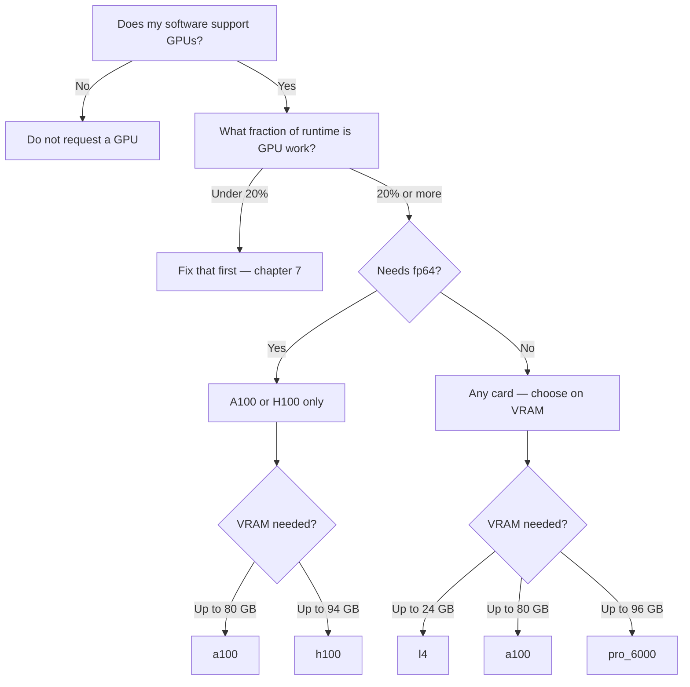

# 9. Choosing a GPU

!!! clipboard-list "Lesson Objectives"

    - Combine the four measurements into a GPU choice you can justify
    - Write the Slurm request that follows from it
    - Know when the right answer is "no GPU"

!!! clipboard-question "Questions"

    - Which GPU should I ask for?
    - How do I know I chose right?

This is the question the workshop opened with, and now it can be answered,
because you have the four things it depends on.

## The four questions

| # | Question | Where you measured it |
|---|---|---|
| 1 | Does my software need fp64? | [Chapter 8](08-precision.md) |
| 2 | How much VRAM does my work need? | [Chapter 5](05-ram-and-vram.md) |
| 3 | How many CPU cores keep the GPU fed? | [Chapter 6](06-how-many-cpus.md) |
| 4 | What fraction of my runtime is on the GPU? | [Chapter 7](07-splitting-the-work.md) |

## The decision



Written out:

1. **If your software has no GPU support, stop.** A GPU will do nothing except
   lengthen your queue time.
2. **If under 20% of your runtime is GPU work, fix that first.** A better card
   cannot help a job that is not using the one it has.
3. **If you need fp64, you are choosing between the A100 and the H100.** The
   L4 and RTX PRO 6000 are out, regardless of anything else.
4. **Otherwise, choose the smallest card your work fits in.**

!!! warning "Ask for the smallest card that fits, not the biggest available"

    This is the part people get wrong, and it costs them time rather than
    saving it.

    - There are more small cards than large ones, and fewer people want them,
      so **your job starts sooner**.
    - A job using 8 GB of an H100 has taken a 94 GB card away from someone with
      a 90 GB model, and gained nothing by it.
    - "Bigger is safer" is not true when the cost of bigger is waiting two days
      in a queue.

    An L4 you can have in ten minutes beats an A100 you get tomorrow.

## Work it through

```bash
cd ~/gpu-training/09_choosing_a_gpu
python3 pick_a_gpu.py
```

It asks the four questions and prints a request. You can also answer up front:

```bash
python3 pick_a_gpu.py --fp64 --vram 30 --cpus 4 --gpu-share 65
```

```
Ask for: NVIDIA A100-SXM4-80GB

  VRAM          80 GB, and you need about 30 GB
  fp64          9.7 TFLOPS (1:2 of its fp32 rate)
  Per node      4

Why this one and not a bigger one:
  The smallest card your work fits in is almost always the right
  choice. It is the one with the shortest queue, and a job that uses
  20% of an A100 has taken a card someone else needed all of.

  Also big enough, if this one is busy: NVIDIA H100 NVL

Your Slurm request
----------------------------------------------------------------------
#!/bin/bash -e
#SBATCH --job-name      my-gpu-job
#SBATCH --account       nesi99991
#SBATCH --time          01:00:00
#SBATCH --cpus-per-task 4
#SBATCH --mem           8GB          # RAM, not VRAM - measure it with seff
#SBATCH --gpus-per-node a100:1
```

The script is short and worth reading — it is the reasoning from the previous
chapters, written down.

## Confirming the choice

Choosing is a hypothesis. Confirm it:

1. Run a **short** version with `--qos debug` and `--time 00:15:00`.
2. `seff` it.
3. Check three things:

| Check | Good | Act on it |
|---|---|---|
| `Peak GPU Utilisation` | Above 40% | Lower: more cores, or chapter 7 |
| `Peak GPU Memory Util` | 40–90% | Under 25%: a smaller card would do. Over 95%: move up, or reduce batch size |
| `Avg CPU Utilisation` | Not near 100% | At 100% with low GPU: starved, add cores |

4. Adjust and queue the real job.

Fifteen minutes here regularly saves days.

!!! dumbbell "Exercise: choose for three researchers"

    Work these out, then check with `pick_a_gpu.py`.

    **A.** Training an image classifier. 2 GB model, batch needs about 6 GB of
    VRAM. fp32. Data loading is heavy; 4 cores got GPU utilisation to 75%.

    **B.** Molecular dynamics, double precision throughout. 3 GB of VRAM. One
    core is enough — the software does everything on the GPU and the GPU stage
    is 95% of the runtime.

    **C.** A genomics pipeline. 40% of runtime is a GPU basecaller needing
    18 GB; the rest is reading files and writing results.

    ??? "Answers"

        **A. `l4:1`, `--cpus-per-task 4`.** fp32, fits in 24 GB comfortably.
        No reason to take a larger card. Good utilisation already.

        **B. `a100:1`, `--cpus-per-task 2`.** The fp64 requirement decides it —
        the L4 would be tens of times slower despite only 3 GB being needed.
        Between the A100 and the H100, take the A100: both are 1:2, and the
        A100 is the less contended.

        This is the case people get wrong most often. A 3 GB job on an 80 GB
        card looks wasteful, and it is still correct.

        **C. `l4:1`**, and then go and look at chapter 7. 18 GB fits an L4. But
        only 40% of the runtime is on the GPU, so the storage side deserves
        attention before any thought of a better card — the ceiling on what one
        could give you is 40%.

## When the answer is "no GPU"

Worth saying plainly. Do not request a GPU when:

- Your software has no GPU support.
- Your problem is small enough that it finishes quickly on CPU anyway.
- Almost all of your runtime is reading, writing or waiting.
- You measured it, and `Peak GPU Utilisation` came out in single figures.

There is no shame in a CPU job. There is real cost in a GPU sitting idle inside
one.

!!! note "Ask for help"

    If you are unsure after all this, the support desk would much rather answer
    "I measured X, Y and Z — which card?" than debug a month of slow jobs
    afterwards. Bring your `seff` output; it answers most of their questions
    before they ask.

!!! graduation-cap "Keypoints"

    - Four measurements decide the card: fp64 or not, VRAM, cores, GPU share of
      runtime.
    - **fp64 is the first filter.** It removes the L4 and RTX PRO 6000 outright.
    - Then take the **smallest card your work fits in**, for a shorter queue and
      a fairer share.
    - Confirm with a 15-minute `--qos debug` job and `seff` before committing.
    - If very little of your runtime is on the GPU, fix that before choosing
      hardware — or do not request one.
